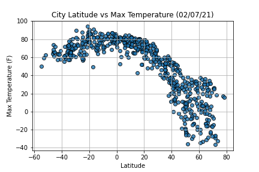
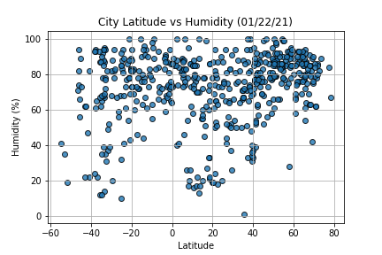
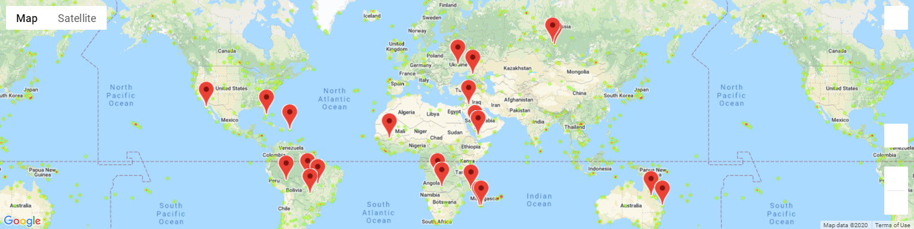

# Python API - What's the Weather Like?

## Background

Whether financial, political, or social -- data's true power lies in its ability to answer questions definitively. 
So we gonna use Python requests, APIs, and JSON traversals to answer a fundamental question: 
* "What's the weather like as we approach the equator?".
* Randomly select 593 unique (non-repeat) cities based on latitude and longitude.
* Perform a weather check on each of the cities using a series of successive API calls.
* Include a print log of each city as it's being processed with the city number and city name.
* Use our top analysis to plan a dream vacation based on weather and amenities available.

## Analysis

## Part I - WeatherPy

* Created a Python script to visualize the weather of 593 cities [Here](WeatherPy/output_data/cities.csv)across the world of varying distance from the equator. 
* To accomplish this, we utilized a [simple Python library](https://pypi.python.org/pypi/citipy),
the [OpenWeatherMap API](https://openweathermap.org/api), and a little common sense to create a representative 
model of weather across world cities.

Created a series of scatter plots to showcase the following relationships:
 * Temperature (F) vs. Latitude
 * Humidity (%) vs. Latitude
 * Cloudiness (%) vs. Latitude
 * Wind Speed (mph) vs. Latitude

#### Temperature vs. Latitude

#### Humidity vs. Latitude

Next we run linear regression on each relationship, only this time separating them into Northern Hemisphere 
(greater than or equal to 0 degrees latitude) and Southern Hemisphere (less than 0 degrees latitude):

* Northern Hemisphere - Temperature (F) vs. Latitude
* Southern Hemisphere - Temperature (F) vs. Latitude
* Northern Hemisphere - Humidity (%) vs. Latitude
* Southern Hemisphere - Humidity (%) vs. Latitude
* Northern Hemisphere - Cloudiness (%) vs. Latitude
* Southern Hemisphere - Cloudiness (%) vs. Latitude
* Northern Hemisphere - Wind Speed (mph) vs. Latitude
* Southern Hemisphere - Wind Speed (mph) vs. Latitude

#### Northern Hemisphere - Temperature vs. Latitude
R squared is: 0.7320859262740624 y = -1.37x + 90.06

#### Southern Hemisphere - Temperature vs. Latitude
R squared is: 0.35329752049275204 y = 0.4x + 82.61

### Part II - VacationPy

Working with weather data to plan future vacations. We used jupyter-gmaps and the Google Places API for this part.

* Created a heat map that displays the humidity for every city from the part I.

#### Heat Map

* Narrow down the DataFrame to find ideal weather condition. For example:

  * A max temperature lower than 80 degrees but higher than 70.

  * Wind speed less than 10 mph.

  * Zero cloudiness.

  * Drop any rows that don't contain all three conditions. You want to be sure the weather is ideal.

* Using Google Places API to find the first hotel for each city located within 5000 meters of our coordinates.

* Plot the hotels on top of the humidity heatmap with each pin containing the **Hotel Name**, **City**, **Rating** and **Country**.

#### Hotel Map

## Conclusion

* As expected, the weather becomes significantly warmer as one approaches the equator (0 Deg. Latitude). More interestingly, however, is the fact that the southern hemisphere tends to be warmer this time of year than the northern hemisphere. This may be due to the tilt of the earth.
* There is no strong relationship between latitude and cloudiness. However, it is interesting to see that a strong band of cities sits at 0, 80, and 100% cloudiness.
* There is no strong relationship between latitude and wind speed. However, in northern hemispheres there is a flurry of cities with over 20 mph of wind.

